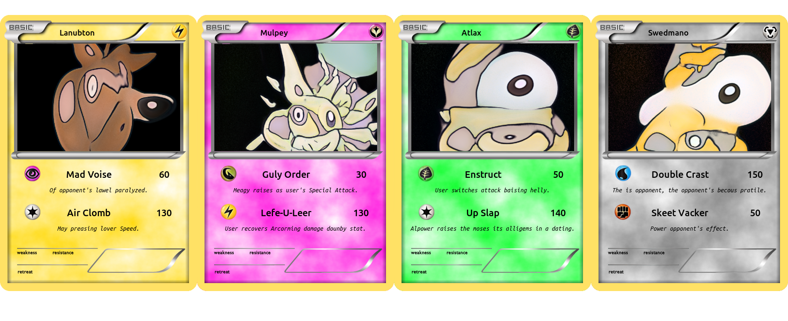

# Pokemon Card Generator



## Run StyleGAN

### StyleGAN Environment

```bash
conda env create -f environment.yml
conda activate stylegan-pokemon
cd stylegan
```

#### StyleGAN Dataset

```bash
aws s3 cp s3://devopstar/resources/stylegan-pokemon/network-snapshot-007961.pkl network-snapshot-007961.pkl
aws s3 sync s3://devopstar/resources/stylegan-pokemon/kaggle-one-shot-pokemon kaggle-one-shot-pokemon
mkdir pokemon
```

#### Prepare Images

```bash
python prepare.py
python dataset_tool.py create_from_images datasets/smalls/ ./pokemon/
```

#### StyleGAN Training

```bash
python train.py
```

#### StyleGAN Invoke [Self-trained]

Using the `network-final.pkl` under the most recent entry in the [stylegan/results](stylegan/results) path

```bash
python invoke.py \
    --model_file './results/00000-sgan-custom-1gpu/network-final.pkl' \
    --output_file '../img/pokemon1.png'
```

#### StyleGAN Invoke [Pre-trained]

```bash
python invoke.py \
    --model_file './network-snapshot-007961.pkl' \
    --output_file '../img/pokemon2.png'
```

#### StyleGAN Invoke [MichaelFriese10](https://twitter.com/MichaelFriese10/status/1127614400750346240)

```bash
aws s3 cp s3://devopstar/resources/stylegan-pokemon/MichaelFriese10_pokemon.pkl MichaelFriese10_pokemon.pkl
python invoke.py \
    --model_file './MichaelFriese10_pokemon.pkl' \
    --output_file '../img/pokemon3.png'
```

## Run RNN

### RNN Environment

```bash
conda activate stylegan-pokemon
cd rnn
```

#### RNN Dataset

Dataset is from [armgilles/pokemon.csv](https://gist.github.com/armgilles/194bcff35001e7eb53a2a8b441e8b2c6)

```bash
ls -al data/input.txt
```

#### RNN Training

```bash
# Pokemon
python train.py \
    --data_dir=./data/pokemon \
    --save_dir=./save/pokemon \
    --seq_length=12

# Moves
python train.py \
    --data_dir=./data/moves \
    --save_dir=./save/moves \
    --rnn_size=300 \
    --seq_length=12

# Description
python train.py \
    --data_dir=./data/desc \
    --save_dir=./save/desc \
    --seq_length=25
```

#### RNN Invoke

```bash
# Pokemon
python sample.py \
    --save_dir=./save/pokemon \
    --output_dir=../samples/pokemon.txt

# Moves
python sample.py \
    --save_dir=./save/moves \
    --output_dir=../samples/moves.txt

# Description
python sample.py \
    --save_dir=./save/desc \
    --output_dir=../samples/desc.txt \
    -n=1500
```

### Cropping

```bash
# Define all fields adhoc
./cropper.sh \
    "Pokemon Name" \
    "Pokemon Attack 1" \
    "Pokemon Attack Description 1" \
    "Pokemon Attack 2" \
    "Pokemon Attack Description 2" \
    "img/pokemon1.png" # Path to input image

# Random
./cropper-shuffle.sh "img/pokemon1.png" # Path to input image
```

## Attribution

* [One-Shot-Pokemon Images](https://www.kaggle.com/aaronyin/oneshotpokemon)
* [Inspired from Andrej Karpathy's char-rnn](https://github.com/karpathy/char-rnn)
* [Pokemon generated by neural network](https://aiweirdness.com/post/147834883707/pokemon-generated-by-neural-network)
* [MichaelFriese10 Pixel art model](https://twitter.com/MichaelFriese10/status/1127614400750346240)